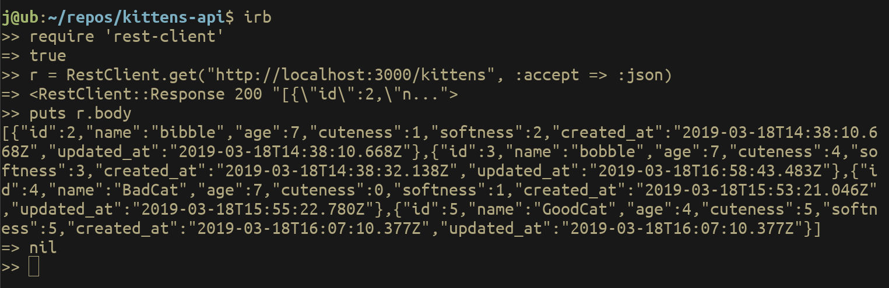

# README

Simon Tharby's solution to [Project 1: Building a Simple Kittens API](https://www.theodinproject.com/courses/ruby-on-rails/lessons/apis?ref=lnav), Project: APIS, Ruby on Rails unit, Odin Project.

## RestClient in IRB:

To query the app via JSON request, you will need the RestClient gem installed. Then, open an IRB console and enter:

```
$ require 'rest-client'
```

```
$ r = RestClient.get("http://localhost:3000/kittens", :accept => :json)
```

```
$ puts r.body
```



## Getting started:

To get started with the app, clone the repo and then install the needed gems:

```
$ bundle install --without production
```

Next, migrate the database:

```
$ rails db:migrate
```

Run the app in a local server:

```
$ rails server
```
